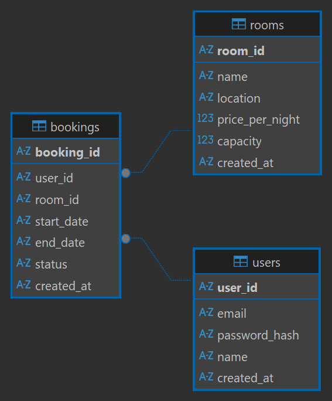

# 1. High-Level Architecture

# 2. API Design
## Authentication & User Management
POST /auth/register
Registers a new user.
Request:
{
  "email": "user@example.com",
  "password": "StrongPass123",
  "name": "John Doe"
}

Response 201:
{
  "userId": "uuid",
  "email": "user@example.com",
  "name": "John Doe",
  "createdAt": "2025-09-05T10:15:00Z"
}

POST /auth/login
Authenticates user and returns a JWT.

## Room Search
GET /rooms/search
Search available rooms.
Response 200:
{
  "results": [
    {
      "roomId": "uuid",
      "name": "Deluxe Room",
      "location": "Berlin",
      "pricePerNight": 120,
      "capacity": 2,
      "amenities": ["wifi", "ac", "tv"],
      "available": true
    }
  ],
  "pagination": {
    "page": 1,
    "limit": 10,
    "total": 25
  }
}

## Booking
POST /bookings
Create a new booking. Auth required.
Response 201:
{
  "bookingId": "uuid",
  "roomId": "uuid",
  "userId": "uuid",
  "status": "confirmed",
  "startDate": "2025-09-10",
  "endDate": "2025-09-15",
  "createdAt": "2025-09-05T10:20:00Z"
}

# 3. Database Schema

## SQL 
CREATE TABLE IF NOT EXISTS "bookings" (
	"booking_id"	varchar(255),
	"user_id"	varchar(255) NOT NULL,
	"room_id"	varchar(255) NOT NULL,
	"start_date"	date NOT NULL,
	"end_date"	date NOT NULL,
	"status"	varchar(20) DEFAULT 'confirmed',
	"created_at"	datetime DEFAULT CURRENT_TIMESTAMP,
	PRIMARY KEY("booking_id"),
	FOREIGN KEY("room_id") REFERENCES "rooms"("room_id") on delete CASCADE,
	FOREIGN KEY("user_id") REFERENCES "users"("user_id") on delete CASCADE,
	CHECK("end_date" > "start_date")
);
CREATE TABLE IF NOT EXISTS "rooms" (
	"room_id"	varchar(255),
	"name"	varchar(100) NOT NULL,
	"location"	varchar(100) NOT NULL,
	"price_per_night"	float NOT NULL,
	"capacity"	integer NOT NULL,
	"created_at"	datetime DEFAULT CURRENT_TIMESTAMP,
	PRIMARY KEY("room_id")
);
CREATE TABLE IF NOT EXISTS "users" (
	"user_id"	char(36),
	"email"	varchar(255) NOT NULL,
	"password_hash"	varchar(255) NOT NULL,
	"name"	varchar(100) NOT NULL,
	"created_at"	datetime DEFAULT CURRENT_TIMESTAMP,
	PRIMARY KEY("user_id")
);
## Indexing Strategy
- users.email → unique index for login
- rooms.location + capacity → for search queries
- bookings.room_id, start_date, end_date → for fast conflict detection

# 4. Concurrency Handling
Using transactions

# 5. Test password for all users: Q1w2e3r4!